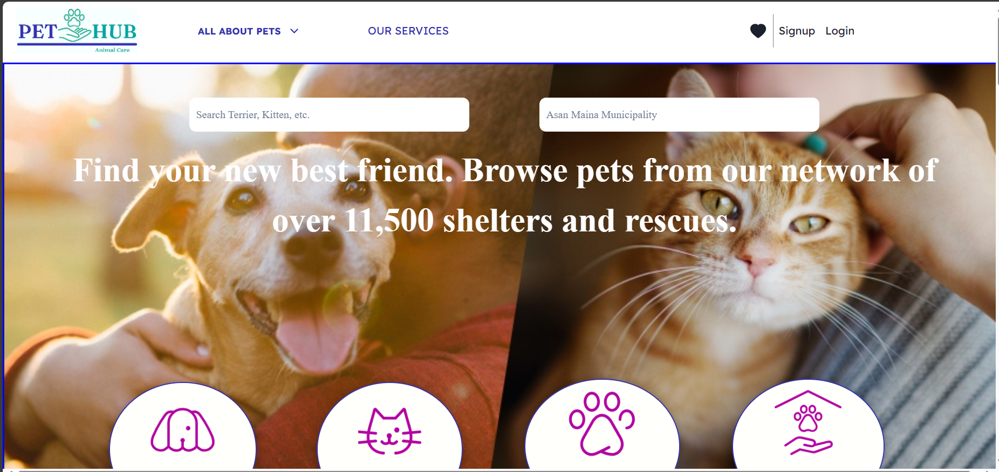
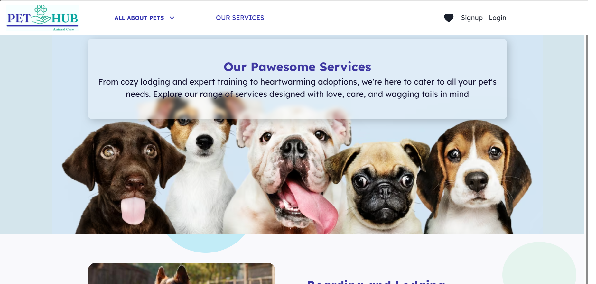
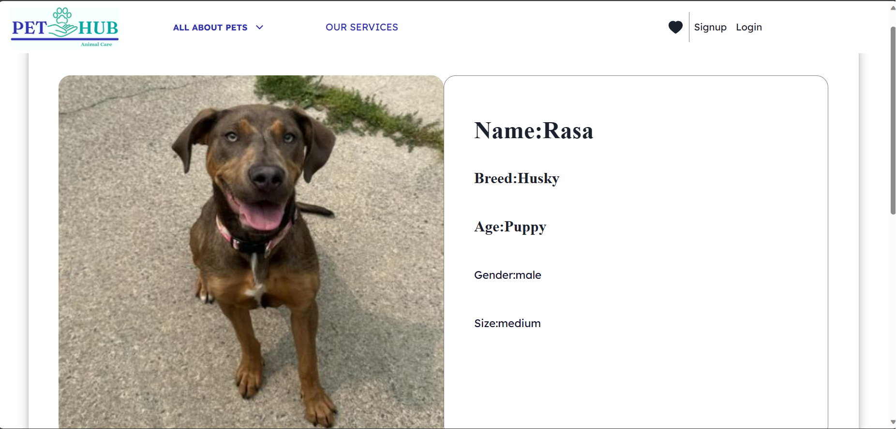
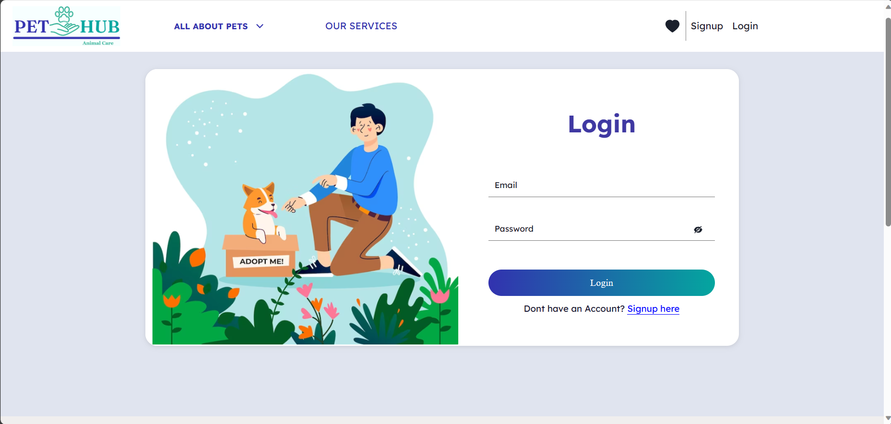
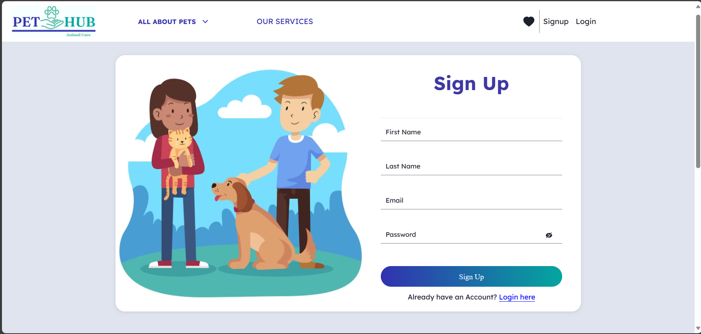

# Project code: resilient-partner-524
Backend deployed link- https://pethub-u60q.onrender.com/pet

# PETHUB

-----
###  ONLINE ANIMAL WELFARE ORGANIZATION* 

Project: Make a Full-Stack website with provided reference website.

Cloned-Website:https://pethub-kappa.vercel.app/

HOW TO GO THROUGH THE PROJECT -
- First, go to Login or signup ( for the first time ).
- After login go to Admin Page.
- Use the following credentials to log in as Admin
   - Username -  
   - Password -  

## Landing Page ()

## Services page

## Single Pet page

## Login Page

## Register Page

petfinder is an Indian online Connect with your perfect furry companion and empower animal welfare organizations with our Pet Adoption Website, featuring pet searches, user accounts, wish lists, adoption requests, and admin controls.

In this project, We have tried to make a FULL-STACK project by manipulating dom elements using REACT, managing state changes using REDUX, CHAKRA UI Library, styling using CSS in react, styling components, and trying to make a responsive website and implementing dynamic routing to persist data. We have managed our database globally using MongoDB Atlas and Express. With the self-learning efforts and the technology stack we have learned till Unit-6 in the Masai School, we could clone the whole website with the same looks & features.

This is a collaborative project built within 5 days by a team of 4 members 

-->  Pranavi Kayapati ( Team Lead ) --> Login / Signup page & services page

-->   Ankit-->Pet page.

-->  Shubham Singh  --> Landing Page, helping in the backend and also making corrections in the pet page.

-->  Aditya  --> Backend.

# Technology Stack Used 🌟
* MongoDB Atlas
* EXPRESS
* MONGOOSE
* REACT
* REDUX
* REACT-REDUX
* CHAKRA UI Library
* Styled-components
* react-router-dom library
* axios library
* Thunk Middleware
* HTML
* CSS
* JavaScript

For storing user data we also used MongoDB Atlas.
